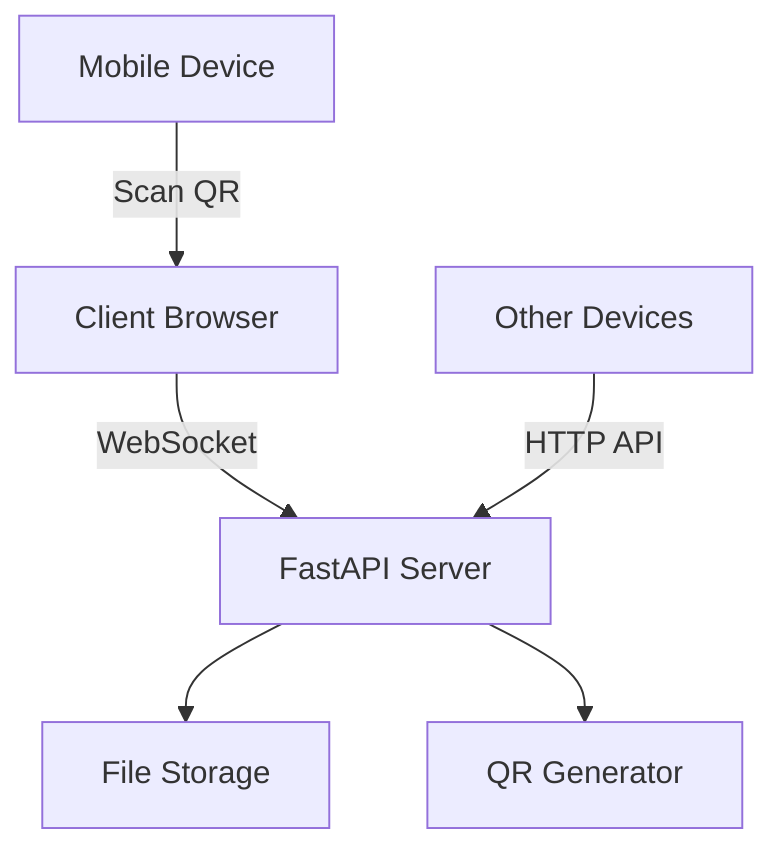

<div align="center">


**⚡ Lightning Fast • Zero Setup • LAN Powered**

[](https://python.org)
[](https://fastapi.tiangolo.com)
[](LICENSE)
[](README.md)

[🎯 Features](#-features) • [🚀 Quick Start](#-quick-start) • [📖 Documentation](#-documentation) • [🛠️ API Reference](#️-api-reference) • [🤝 Contributing](#-contributing)

</div>

---

## 🚀 Quick Start

### 📦 One-Click Installation

<details>
<summary><b>🪟 Windows Users</b></summary>

```batch
# Download and extract the project
# Double-click run.bat
# Browser opens automatically - You're ready! 🎉
```

**Requirements:** Python 3.8+ (auto-installed if missing)

</details>

<details>
<summary><b>🐧 Linux/macOS Users</b></summary>

```bash
# Clone repository
git clone https://github.com/yadavnikhil03/lan-dropspot.git
cd lan-dropspot

# One-line setup
chmod +x run.sh && ./run.sh
```

**Requirements:** Python 3.8+, pip

</details>

<details>
<summary><b>🐳 Docker Deployment</b></summary>

```bash
# Pull and run
docker run -p 8000:8000 -v $(pwd)/uploads:/app/uploads yadavnikhil03/lan-dropspot

# Or with docker-compose
docker-compose up -d
```

</details>

---

## 📖 Documentation

### 🏗️ Architecture Overview



---

## 🛠️ API Reference

### 📡 REST Endpoints

<details>
<summary><b>📤 File Upload</b></summary>

```http
POST /api/upload
Content-Type: multipart/form-data

# Request
files: <file1>, <file2>, ...

# Response
{
  "files": [
    {
      "id": "uuid-string",
      "name": "document.pdf",
      "size": 1024576,
      "expires_at": "2025-01-14T15:30:00Z"
    }
  ]
}
```

</details>

<details>
<summary><b>📋 List Files</b></summary>

```http
GET /api/files

# Response
{
  "files": [...],
  "total": 5,
  "server_ip": "192.168.1.100"
}
```

</details>

<details>
<summary><b>⬇️ Download File</b></summary>

```http
GET /api/download/{file_id}

# Response: File stream with appropriate headers
Content-Disposition: attachment; filename="document.pdf"
Content-Type: application/pdf
```

</details>

### 🔌 WebSocket Events

```javascript
// Connection events
ws.onmessage = (event) => {
  const data = JSON.parse(event.data);
  
  switch(data.type) {
    case 'file_uploaded':   // New file available
    case 'file_downloaded': // File access logged
    case 'file_expired':    // File auto-removed
    case 'server_status':   // Server health update
  }
}
```

---

## ⚙️ Configuration

### 🔧 Environment Variables

```bash
# Server Configuration
export LAN_DROPSPOT_PORT=8000
export LAN_DROPSPOT_HOST=0.0.0.0
export LAN_DROPSPOT_DEBUG=false

# File Management
export FILE_EXPIRY_MINUTES=30
export MAX_FILE_SIZE_MB=100
export CLEANUP_INTERVAL_MINUTES=30

# Security
export ENABLE_CORS=true
export ALLOWED_ORIGINS="*"
```

### 📝 Configuration File

```yaml
# config.yaml
server:
  host: "0.0.0.0"
  port: 8000
  debug: false

files:
  expiry_minutes: 30
  max_size_mb: 100
  cleanup_interval: 30
  storage_path: "./uploads"

security:
  cors_enabled: true
  allowed_origins: ["*"]
  rate_limiting: true
```

---

## 🧪 Development

### 🔨 Setup Development Environment

```bash
# Clone repository
git clone https://github.com/yadavnikhil03/lan-dropspot.git
cd lan-dropspot

# Create virtual environment
python -m venv venv
source venv/bin/activate  # Linux/macOS
# venv\Scripts\activate   # Windows

# Install dependencies
pip install -r requirements-dev.txt

# Run in development mode
uvicorn backend.main:app --reload --host 0.0.0.0 --port 8000
```

### 🧪 Testing

```bash
# Run test suite
pytest tests/ -v

# Coverage report
pytest --cov=backend tests/

# Load testing
locust -f tests/load_test.py --host=http://localhost:8000
```

### 📊 Performance Monitoring

```bash
# Memory usage
python -m memory_profiler backend/main.py

# Profile API endpoints
python -m cProfile -o profile.stats backend/main.py
```

---

## 🚀 Deployment

### 🌐 Production Deployment

<details>
<summary><b>🐳 Docker Production</b></summary>

```bash
# Build production image
docker build -t lan-dropspot:production .

# Deploy with docker-compose
docker-compose -f docker-compose.prod.yml up -d

# Scale horizontally
docker-compose up --scale app=3
```

</details>

<details>
<summary><b>☁️ Cloud Deployment</b></summary>

```bash
# AWS ECS
aws ecs create-cluster --cluster-name lan-dropspot
aws ecs register-task-definition --cli-input-json file://task-definition.json

# Kubernetes
kubectl apply -f k8s/
kubectl get services lan-dropspot
```

</details>

### 📈 Monitoring & Logging

```bash
# Health check endpoint
curl http://localhost:8000/health

# Metrics (Prometheus format)
curl http://localhost:8000/metrics

# Logs
docker logs lan-dropspot --follow
```
---

## 🤝 Contributing

### 🌟 How to Contribute

1. **🍴 Fork** the repository
2. **🌿 Create** a feature branch (`git checkout -b feature/amazing-feature`)
3. **💻 Commit** your changes (`git commit -m 'Add amazing feature'`)
4. **📤 Push** to the branch (`git push origin feature/amazing-feature`)
5. **🎯 Open** a Pull Request

### 📋 Development Guidelines

- Follow [PEP 8](https://pep8.org/) for Python code
- Write comprehensive tests for new features
- Update documentation for any API changes
- Use conventional commits for clear history

---

## 🆘 Troubleshooting

<details>
<summary><b>🔧 Common Issues</b></summary>

### Server Won't Start
```bash
# Check Python version
python --version  # Should be 3.8+

# Verify port availability
netstat -tulpn | grep 8000

# Install dependencies
pip install -r requirements.txt
```

### Network Access Issues
```bash
# Check firewall
sudo ufw allow 8000  # Linux
netsh advfirewall firewall add rule name="LAN DropSpot" dir=in action=allow protocol=TCP localport=8000  # Windows

# Verify network interface
ip addr show  # Linux
ipconfig  # Windows
```

</details>

---

## 📄 License

This project is licensed under the MIT License - see the [LICENSE](LICENSE) file for details.

```
MIT License

Copyright (c) 2025 Nikhil Yadav

Permission is hereby granted, free of charge, to any person obtaining a copy
of this software and associated documentation files (the "Software"), to deal
in the Software without restriction, including without limitation the rights
to use, copy, modify, merge, publish, distribute, sublicense, and/or sell
copies of the Software, and to permit persons to whom the Software is
furnished to do so, subject to the following conditions:

The above copyright notice and this permission notice shall be included in all
copies or substantial portions of the Software.

THE SOFTWARE IS PROVIDED "AS IS", WITHOUT WARRANTY OF ANY KIND, EXPRESS OR
IMPLIED, INCLUDING BUT NOT LIMITED TO THE WARRANTIES OF MERCHANTABILITY,
FITNESS FOR A PARTICULAR PURPOSE AND NONINFRINGEMENT. IN NO EVENT SHALL THE
AUTHORS OR COPYRIGHT HOLDERS BE LIABLE FOR ANY CLAIM, DAMAGES OR OTHER
LIABILITY, WHETHER IN AN ACTION OF CONTRACT, TORT OR OTHERWISE, ARISING FROM,
OUT OF OR IN CONNECTION WITH THE SOFTWARE OR THE USE OR OTHER DEALINGS IN THE
SOFTWARE.
```

---

## � Support

<div align="center">

### Show Your Support

⭐ **Star this repository** if you found it helpful!

[](https://github.com/yadavnikhil03/LAN-DropSpot)
[](https://github.com/yadavnikhil03/LAN-DropSpot)

</div>

---

<div align="center">

**🚀 Made with ❤️ by [Nikhil Yadav](https://github.com/yadavnikhil03)**


</div>
